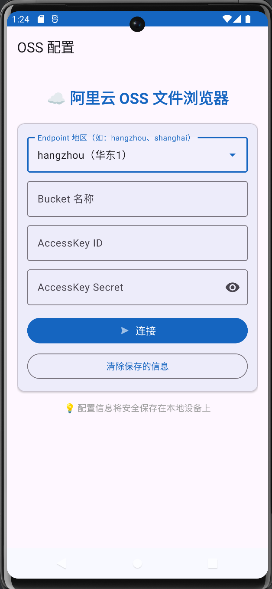
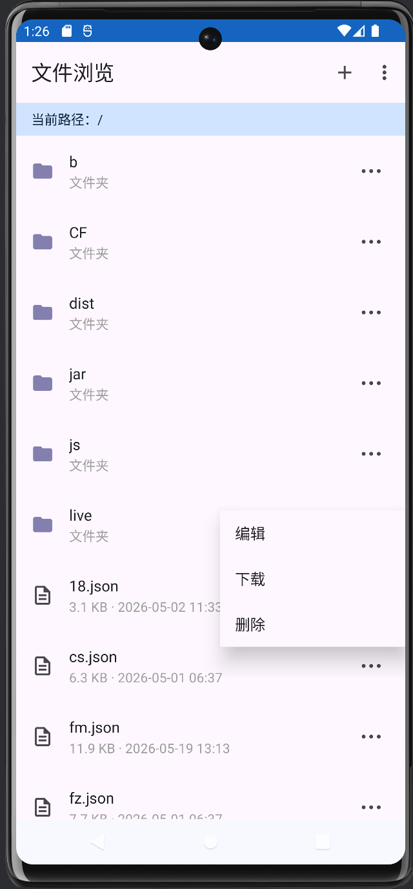

# OSS 文件浏览器

> 一个简洁的阿里云 OSS 文件管理 Android 应用，支持文件浏览、编辑、上传、下载和删除。

## 📱 功能特性

| 功能 | 说明 |
|------|------|
| 🔐 **安全登录** | 支持选择 OSS 地区、输入 Bucket 和 AccessKey，凭证本地加密保存 |
| 📂 **文件浏览** | 浏览 OSS Bucket 中的文件和文件夹，支持多级目录导航 |
| ✏️ **文本编辑** | 支持 50+ 种文本格式（JSON、TXT、XML、MD 等）在线编辑和保存 |
| ⬆️ **文件上传** | 从手机选择文件上传到 OSS 当前目录 |
| ⬇️ **文件下载** | 将 OSS 文件下载到本地手机存储 |
| 🗑️ **文件删除** | 快捷删除 OSS 中的文件 |
| 🔄 **自动登录** | 首次配置后下次自动连接，无需重复输入 |

## 📷 界面预览

### 登录配置页


### 文件浏览页


## 🛠️ 技术栈

| 技术 | 版本 |
|------|------|
| **语言** | Kotlin |
| **最低 SDK** | API 26 (Android 8.0) |
| **目标 SDK** | API 35 |
| **UI 框架** | Material Design 3 |
| **网络库** | 阿里云 OSS Android SDK 2.9.21 |
| **数据存储** | DataStore Preferences |
| **异步处理** | Kotlin Coroutines |
| **架构** | MVVM（轻量级） |

## 📁 项目结构

```
OSSBrowser/
├── app/
│   └── src/main/
│       ├── java/com/qile/ossbrowser/
│       │   ├── OSSBrowserApp.kt          # Application 入口
│       │   ├── data/
│       │   │   ├── OSSConfigManager.kt   # OSS 配置持久化管理
│       │   │   └── OSSFileRepository.kt  # OSS 文件操作（列表/上传/下载/删除）
│       │   ├── ui/
│       │   │   ├── login/
│       │   │   │   └── LoginActivity.kt  # 登录配置页
│       │   │   ├── file/
│       │   │   │   ├── FileBrowseActivity.kt  # 文件浏览主页
│       │   │   │   └── FileAdapter.kt     # 文件列表适配器
│       │   │   └── editor/
│       │   │       └── TextEditorActivity.kt  # 文本编辑器
│       │   └── util/
│       │       └── FileUtils.kt           # 文件工具类
│       └── res/
│           ├── layout/                    # 布局文件
│           ├── drawable/                  # 图标资源
│           ├── menu/                      # 菜单资源
│           └── values/                    # 字符串/颜色/主题
└── doc/
    ├── screenshot_login.png               # 登录页截图
    └── screenshot_browse.png              # 文件浏览页截图
```

## 🚀 使用方法

### 1. 开发环境

- **推荐 IDE**：Android Studio（Ladybug 2024.2.1 或更新版本）
- **Gradle**：8.10.2
- **AGP**：8.7.3
- **Kotlin**：1.9.25

### 2. 运行项目

1. 用 Android Studio 打开 `OSSBrowser` 目录
2. 等待 Gradle 同步完成（首次需下载依赖）
3. 连接 Android 设备或启动模拟器
4. 点击 **Run → Run 'app'** 或按 `Shift + F10`

### 3. 打包 APK

**Debug 版本（测试用）**：
- 菜单 **Build → Build Bundle(s) / APK(s) → Build APK(s)**
- 输出位置：`app/build/outputs/apk/debug/app-debug.apk`

**Release 版本（正式发布）**：
1. 菜单 **Build → Generate Signed Bundle / APK...**
2. 选择 **APK → Next**
3. 创建签名密钥（首次）或选择已有密钥
4. 选择 **release** 构建类型
5. 完成打包

### 4. 安装使用

1. 将 APK 文件传到手机
2. 手机开启"允许安装未知来源应用"
3. 点击安装 APK
4. 打开应用，填写 OSS 配置信息：
   - **Endpoint 地区**：从下拉列表选择（如 hangzhou）
   - **Bucket 名称**：你的 OSS Bucket 名称
   - **AccessKey ID/Secret**：阿里云 AccessKey 凭证

## 🔧 支持的 OSS 地区

应用内置支持以下阿里云 OSS 地区：

| 地区标识 | 显示名称 | Endpoint |
|----------|----------|----------|
| hangzhou | 华东1（杭州） | oss-cn-hangzhou.aliyuncs.com |
| shanghai | 华东2（上海） | oss-cn-shanghai.aliyuncs.com |
| beijing | 华北2（北京） | oss-cn-beijing.aliyuncs.com |
| shenzhen | 华南1（深圳） | oss-cn-shenzhen.aliyuncs.com |
| hongkong | 香港 | oss-cn-hongkong.aliyuncs.com |
| singapore | 新加坡 | oss-ap-southeast-1.aliyuncs.com |
| tokyo | 东京 | oss-ap-northeast-1.aliyuncs.com |
| silicon-valley | 硅谷 | oss-us-west-1.aliyuncs.com |
| virginia | 弗吉尼亚 | oss-us-east-1.aliyuncs.com |
| ... | 更多... | ... |

## 📝 支持的文本编辑格式

`txt`, `log`, `json`, `xml`, `html`, `css`, `js`, `ts`, `jsx`, `tsx`, `vue`, `md`, `markdown`, `csv`, `yaml`, `yml`, `properties`, `conf`, `cfg`, `ini`, `sh`, `bat`, `py`, `java`, `kt`, `c`, `cpp`, `go`, `rs`, `sql`, `gradle`, `toml` 等 50+ 种格式。

## ⚠️ 注意事项

1. **安全提醒**：AccessKey 凭证会保存在本地，请勿在公共设备上使用
2. **网络要求**：需要稳定的网络连接才能访问 OSS
3. **文件大小**：上传功能适合小文件，大文件建议使用分片上传
4. **模拟器问题**：部分模拟器网络可能不稳定，建议使用真机测试

## 📄 开源协议

本项目仅供学习交流使用，请遵守阿里云 OSS 服务协议。
